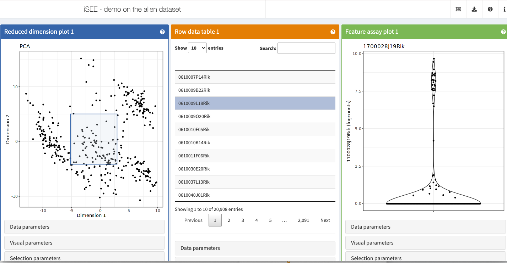

# STAT 679 / 992: Statistical Data Visualization

## Fall 2023

```{r setup, include=FALSE}
library(tidyverse)
library(knitr)
opts_chunk$set(
  echo = TRUE,
  message = FALSE,
  warning = FALSE,
  cache = TRUE,
  dpi = 200,
  fig.align = "center",
  out.width = 650,
  fig.height = 3,
  fig.width = 9
  )
th <- theme_minimal() +
  theme(
    panel.grid.minor = element_blank(),
    panel.background = element_rect(fill = "#f7f7f7"),
    panel.border = element_rect(fill = NA, color = "#0c0c0c", size = 0.6),
    axis.text = element_text(size = 14),
    axis.title = element_text(size = 16),
    legend.position = "bottom"
  )
theme_set(th)
options(width = 100)
```

---

# September 7, 2023

1. Review syllabus
1. Review class resources
1. In-Class Exercise 0.1

---

### Welcome!!

I'm excited to share this course with you this semester. There are few
activities that engage creative, quantitative, and critical thinking skills all
at once, but data visualization is one of them.

Nothing makes my day like a good data visualization, and I look forward to
seeing those that you create.

---

### Syllabus

* Learning outcomes
* Teaching team and office hours
* Assessments
* Grading

---

### Learning Outcomes

In this class, you will learn to...

1. Draw from a **catalog of visual encodings** to support specific visual comparisons in temporal, geospatial, network, hierarchical, high-dimensional count, text, and uncertain data and demonstrate facility implementing them using the R and javascript programming languages.
2.	Draw from a **catalog of interactivity patterns** to compose visualizations that
respond to user’s dynamic queries.
3.	Using the vocabulary of data visualization, **analyze and critique visual designs**.

---

### Learning Outcomes

In this class, you will learn to...

4.	Given a data analysis problem and initial design solution, iteratively **refine visual encodings and interactivity** idioms from across the design space until a satisfactory solution is discovered.
5.	**Navigate the data visualization research literature**, summarize the contributions of a specific methodological proposal, and evaluate their applicability in specific problem contexts.

---

### Office Hours

We will announce in-person and virtual office hours depending on the results of
this poll: https://go.wisc.edu/93oh27

---

### Assessments

* In-class exercises and discussions graded for completeness
* 4 problem sets 
* 3 group project reports and 1 presentation
  - Teams of 4 - 5 people
* 1 midterm exam

---

### Grading

* Problem Sets: 35%
* Group Project: 25%
* In-Class Exercises: 20%
* Midterm: 20%

---

### Canvas Page Walkthrough

```{r, echo = FALSE}
include_graphics("figures/canvas.png")
```

---

### Class Resources

1. [Canvas page](https://canvas.wisc.edu/courses/374041)
  - Links to all other resources
1. [Readings](https://drive.google.com/file/d/16jr5MlX8axfDVZ3kS4vZuWzqDOpj1Wng/view?usp=sharing)
1. [Exercises](https://canvas.wisc.edu/courses/374041/files?preview=33640181)
1. [Online notes](https://krisrs1128.github.io/stat992_f23/website/docs/)
1. [Online recordings](https://mediaspace.wisconsin.edu/) (also linked in notes)

---

### Last Year's Course Reflections

* [https://go.wisc.edu/vwie77](https://go.wisc.edu/vwie77)

---

### Questions?

Also feel free to speak with me after class.

---

### Send me visualizations

If over the course of the semester you find a data visualization that you think
might be interesting to the class, send me a link! There's a lot that can be
learned through imitation.

Examples: 
* https://book.rwithoutstatistics.com/data-viz-chapter.html
* https://ijeamaka.art/portfolio/radial_patterns/
* https://observablehq.com/@visionscarto/potential-dollar-flows?collection=@visionscarto/30daymapchallenge
* http://nbremer.github.io/urbanization/

---

### Exercise 0.1

1. Introduce yourself to at least two people who you do not already know.

1. Submit a response to [Formulating Questions] in the exercise sheet.

1. Share your chosen datasets in small groups.

[Formulating Questions] Pick a dataset from
[TidyTuesday](https://github.com/rfordatascience/tidytuesday#datasets), [Data Is
Plural](https://docs.google.com/spreadsheets/d/1wZhPLMCHKJvwOkP4juclhjFgqIY8fQFMemwKL2c64vk/edit#gid=0),
[Kaggle Datasets](https://www.kaggle.com/datasets), [Google Dataset
Search](https://datasetsearch.research.google.com/), or your own personal
studies that you would like to visualize this semester. What makes you
interested in this dataset? Please provide a link, so we can refer to the data in future sessions.

---

# September 12, 2023

1. Exercise review
1. In-Class Demo [City Temperatures]
1. In-Class Exercise 1.1

---

### Announcements

1. Office hours will be held Mondays 3:15 - 4:30pm and Wednesdays 10am -
11:15am. You can join in person at Medical Sciences Center 7225C or through
Zoom.

1. The description for how to form groups is in Project Milestone 0. If you do
not form a team by the deadline, you will be randomly assigned one.

1. Problem set 1 is online.

1. Project Milestone 0 (Forming Groups) is due on September 18.

---

### Beautiful Visualizations - Comments?

.pull-left[

]

.pull-right[
[Source](https://www.behance.net/gallery/78642081/IAU100-exhibition-data-visualization-and-graphics)

[Plot background](https://stackoverflow.com/questions/51255832/how-to-add-an-image-on-ggplot-background-not-the-panel)
]

---

### Exercise Review

Let's analyze the exercise results together.

[https://go.wisc.edu/fzn067](https://go.wisc.edu/fzn067)

---

### In-Class Demo 1.1

[https://go.wisc.edu/fzn067](https://go.wisc.edu/fzn067)

We'll also see how you can submit results using Rmarkdown.

---

### Exercise 1.1

The data below measures properties of various Antarctic penguins.

```{r, echo = TRUE}
penguins <- read_csv("https://uwmadison.box.com/shared/static/ijh7iipc9ect1jf0z8qa2n3j7dgem1gh.csv")
```

Create a single plot that makes it easy to answer both of these questions,
(i) How is bill length related to bill depth within and across species? (ii)
On which islands are which species found?

Read about [Simpson's
paradox](https://en.wikipedia.org/wiki/Simpson%27s_paradox) and summarize it
in your own words. Then, explain how part (i) provides a real-world example
of this paradox.

If you finish early -- can you think of an alternative encoding that
visualizes the same information? How do the encodings compare and contrast
with one another?

---

# September 14, 2023

1. Exercise review
1. In-Class Demo [Plant growth]
1. (If Time) Discussion [When2meet]
1. [In-Class Exercise 1.2]

---

### Announcements

1. The description for how to form groups is in Project Milestone 0. If you do
not form a team by the deadline, you will be randomly assigned one.

1. Problem set 1 is online.

1. Project Milestone 0 (Forming Groups) is due on September 18.


---

### Beautiful Visualizations - Comments?

.pull-left[

]

.pull-right[
[Source](https://ig.ft.com/sites/novak-djokovic-the-best-tennis-season-ever/)
]

---

### Exercise Review

This is an exercise in compactly encoding a mix of continuous (bill length and
depth) and nominal (species and island) variables. There are several approaches
possible, and there are trade-offs between them,

  * Color and shape: It's convenient to place all data into the same space, but
  shapes can be hard to read.
  * Color combinations: It's easier to distinguish colors than shapes, but requires
  continually looking up which color is which combination.
  * Faceting: Easier to compare combination, but each panel gets less space.
  
---

### Exercise Review

```{r, fig.width = 6, fig.height = 4, out.width = 600}
ggplot(penguins) +
  geom_point(aes(bill_length_mm, bill_depth_mm, col = species, shape = island))
```

---

```{r, fig.width = 6, fig.height = 4, out.width = 550}
ggplot(penguins) +
  geom_point(aes(bill_length_mm, bill_depth_mm, col = species, shape = island)) +
  scale_color_brewer(palette = "Set2") +
  scale_shape_manual(values = c(16, 0, 8)) +
  labs(
    x = "Bill Depth",
    y = "Bill Length"
  )
```
---

```{r, fig.width = 6, fig.height = 4, out.width = 550}
ggplot(penguins) +
  geom_point(aes(bill_length_mm, bill_depth_mm, col = interaction(species, island))) +
  scale_color_brewer(palette = "Set2") +
  theme(strip.text = element_text(size = 18)) +
  labs(
    x = "Bill Depth",
    y = "Bill Length"
  )
```

---

### Exercise Review

```{r, fig.width = 12, fig.height = 4, out.width = 1000}
ggplot(penguins) +
  geom_point(aes(bill_length_mm, bill_depth_mm, col = species)) +
  facet_wrap(~ island)
```

---

### Exercise Review

```{r, fig.width = 12, fig.height = 4, out.width = 800}
ggplot(penguins) +
  geom_point(aes(bill_length_mm, bill_depth_mm, col = species)) +
  facet_wrap(~ island) +
  scale_color_brewer(palette = "Set2") +
  theme(strip.text = element_text(size = 18)) +
  labs(
    x = "Bill Depth",
    y = "Bill Length"
  )
```

---

### Exercise Review

```{r, fig.width = 6, fig.height = 4, out.width = 320}
ggplot(penguins, aes(bill_length_mm, bill_depth_mm)) +
  geom_point(aes(col = species, shape = island)) +
  stat_smooth(aes(col = species), method = "lm", se = FALSE) +
  stat_smooth(method = "lm", se = FALSE, col = "#0c0c0c") +
  scale_color_brewer(palette = "Set2") +
  scale_shape_manual(values = c(16, 0, 8)) +
  theme(strip.text = element_text(size = 18)) +
  labs(
    x = "Bill Depth",
    y = "Bill Length"
  )
```

---

### Exercise Review

```{r}
ggplot(penguins, aes(bill_length_mm, bill_depth_mm)) +
  geom_point(aes(col = species)) +
  stat_smooth(aes(col = species), method = "lm", se = FALSE) +
  stat_smooth(method = "lm", se = FALSE, col = "#0c0c0c") +
  facet_wrap(~ island) +
  scale_color_brewer(palette = "Set2") +
  theme(strip.text = element_text(size = 18)) +
  labs(
    x = "Bill Depth",
    y = "Bill Length"
  )
```

---

### Discussion [When2Meet]

* With your neighbors, work through (a - c) of [When2Meet] on the exercise
sheet
* I will ask groups to share brief a summary of their discussions with the rest
of the class
* The question is included on the next slide

---

In addition to being a scheduling tool, When2Meet polls provide a heatmap
visualization of respondent availability. In this exercise, use the results from
our [office hour poll](https://www.when2meet.com/?16334941-sIMyb) to evaluate
the properties of this visualization.

  a. What are two concrete questions that the heatmap visualization is
  effective at answering? Why do you think this?
  
  b. What are two concrete questions that the heatmap visualization is *not* 
  effective at answering? Why do you think this?
  
  c. Describe an alternative static or interactive visual design that is
  better suited to one of the questions you identified in (b).
  
  d. The dataset at [this link](https://raw.githubusercontent.com/krisrs1128/stat679_code/main/examples/week1/when2meet_679f22.csv) include responses from our poll. Columns 1 - 35 represent students, and 1/0
  denotes whether the student is or is not available. Implement a version of
  your proposed visual design from (c).
  
---

### In-Class Demo 1.2

[https://go.wisc.edu/7if91e](https://go.wisc.edu/7if91e)

We'll also see how you can submit results using Rmarkdown.

---

### Exercise 1.2

In teams of 2 - 4 people, work through [Concept Map] in the exercise sheet. For
submission, include a photo of your concept map and summarize the main points
from your discussion.

[Concept Map] Prepare a concept map to summarize the last week of reading
material. An effective submission will include a thorough coverage of both
abstract concepts and practical examples, summarized concisely into short
phrases. It will also include well-justified links between nodes, with text
explanations for edges whose interpretation might not be obvious at first.

---

# September 19, 2023

1. Exercise review
1. Code demo [Improving an App]
1. [In-Class Exercise 2.1]

---

### Announcements

1. Problem Set 1 is due October 2
1. Project Milestone 1 is due October 16
1. Please remember that there are course recordings linked to the notes

---

### Discussion [When2Meet]

* With your neighbors, work through (a - c) of [When2Meet] on the exercise
sheet
* I will ask groups to share brief a summary of their discussions with the rest
of the class
* The question is included on the next slide

---

In addition to being a scheduling tool, When2Meet polls provide a heatmap
visualization of respondent availability. In this exercise, use the results from
our [office hour poll](https://www.when2meet.com/?20896504-xidOG) to evaluate
the properties of this visualization.

  a. What are two concrete questions that the heatmap visualization is
  effective at answering? Why do you think this?
  
  b. What are two concrete questions that the heatmap visualization is *not* 
  effective at answering? Why do you think this?
  
  c. Describe an alternative static or interactive visual design that is
  better suited to one of the questions you identified in (b).
  
  d. The dataset at [this link](https://raw.githubusercontent.com/krisrs1128/stat679_code/main/examples/week1/when2meet_679f22.csv) include responses from our poll. Columns 1 - 35 represent students, and 1/0
  denotes whether the student is or is not available. Implement a version of
  your proposed visual design from (c).

---

### Exercise Review

A few common themes emerged across most submissions,

* The distinctions between data, geometry, and encoding in ggplot2
* Descriptions of what make an encoding / visualization effective
  - Clear comparisons, overall readability, orientation around specific tasks
* Description of the different ggplot2 geometry layers
* Examples of faceting and when it can be helpful

---

### In-Class Demo [Improving an App]

* This exercise uses reactive expressions to make messy (but still functional)
Shiny apps more readable

* [https://go.wisc.edu/7mh8l5](https://go.wisc.edu/7mh8l5)

---

### Exercise 2.1

[Olympics Interactive App] 
 
 Hints:
 
   *  For part (a), a `renderPlot()` server element needs to be rerun each time
   the sports `selectInput` has been changed.
   * For part (b), consider how we shared filtered data across server elements
   in the penguin example today.
 
---

### September 21, 2023

1. Exercise review
1. Code demo [California Wildfires]
1. [In-Class Exercise 2.2]

---

### Announcements

1. Problem Set 1 is due October 2
1. Project Milestone 1 is due October 16

---

### Beautiful Visualizations

.pull-left[

]

.pull-right[
Interactive SummarizedExperiment Explorer

* [Publication](https://bioconductor.org/packages/release/bioc/html/iSEE.html#:~:text=doi%3A10.12688/f1000research.14966.1)
* [Example](http://shiny.imbei.uni-mainz.de:3838/iSEE/)
* [Source Code](https://github.com/iSEE/iSEE)
]

---

### Exercise Review

**Part (a)**: The following server code creates a "selected" column specifying
whether the athlete competes in one of the selected sports.

```{r}
server <- function(input, output) {
  current_data <- reactive({
    olympics %>%
      mutate(selected = Sports %in% input$dropdown)
  })
  
  output$scatterplot <- scatterplot(current_data())
}
```

---

### Exercise Review

<iframe src="https://data-viz.it.wisc.edu/content/5c919ba9-52e0-4f3a-ba35-47a58eed16fd" width=800 height=500/>

---

### Exercise Review

**Part (b)**: We can introduce a `dataTableOutput` to print the selected athletes.

```{r, eval = FALSE}
ui <- fluidPage(
  selectInput("dropdown", "Select a Sport", choices = unique(olympics$Sport), multiple = TRUE),
  plotOutput("scatterplot"),
  dataTableOutput("table")
)
    
```

---

### Exercise Review

We can use the same reactive as before to populate the table.

```{r}
server <- function(input, output) {
  updated <- reactive({
    olympics %>%
      mutate(selected = Sport %in% input$dropdown)
  })
  
  output$scatterplot <- renderPlot(scatterplot(updated()))
  output$table <- renderDataTable(
    updated %>% filter(selected)
  )
}
```

---

### Exercise Review

<iframe src="https://data-viz.it.wisc.edu/content/04140b59-14cd-4c04-91b2-a0c64e6ee29c" width=800 height=500/>

---

### Exercise Review

.pull-left[
* This is also our first visualization implementing something like a "Focus +
Context Principle." 
* We're able to zoom into a few elements of interest without
losing the overall context.
]

.pull-right[
<iframe src="https://player.vimeo.com/video/363453522?h=ea9887b2e6" width="610" height="330" frameborder="0" allow="autoplay; fullscreen; picture-in-picture" allowfullscreen></iframe>
<p><a href="https://vimeo.com/363453522">[VIS19 Preview] Periphery Plots for Contextualizing Heterogeneous Time-Based Charts (short paper)</a></p>
]

---

### Code Demo

* This exercise will give some more practice with Shiny visualization. We'll
look at a dataset of California Wildfires between 2013 and 2019.

* [Link]

---

### In-Class Exercise

In your project group, work through [Reactivity Graphs] in the exercise sheet.

For submission, have one member of your team submit a short video of the
original interactive visualization and a sketch of the reactive graph you
derived from it.

Additionally:  Identify one point of common confusion across your group. Include
this in your write-up so that we can go over the most common ones during lecture
on Monday.

---

### September 26, 2023

1. [In-Class Demo 3.1]
1. [In-Class Exercise 3.1]

---

### Announcements

1. Problem Set 1 is due October 2
1. Project Milestone 1 is due October 16

---

### Shiny Apps in Problem Sets

If you tried compiling a Shiny app within an rmarkdown document, you probably
saw a message like the one below,


You did not make a mistake! Shiny doesn't allow you to host an app within an
Rmarkdown document, unfortunately.

---

### Shiny Apps in Submissions

To let us grade your Shiny apps within the problem sets, you have two options,

1. Include a screen recording of your app along with the code you used to create
it. You do not need to share the code as R scripts -- we will just read the code
as it's embedded in the main write-up.

1. You could try hosting your app on a public site. UW Madison has an Rstudio
Connect account, which lets you host apps for free. You can sign up
[here](https://it.wisc.edu/news/rstudio-team-pilot/).

---

### Beautiful Visualizations

[https://alhill.shinyapps.io/COVID19seir/](https://alhill.shinyapps.io/COVID19seir)

[https://peopleofthepandemicgame.com/](https://peopleofthepandemicgame.com/)


---

### In-Class Demo

* This exercise uses extends our earlier wildfires app to use graphical inputs

* Demo link: [https://go.wisc.edu/34u1t5](https://go.wisc.edu/34u1t5)

---

### In-Class Demo

[https://go.wisc.edu/3uv12r](https://go.wisc.edu/3uv12r)

Right now, the dotplot responds to the brushed histogram. However,

  * The dotplot does not allow any user inputs.
  * The histogram does not reflect year or user selections.

Imagine someone came to your statistical consulting hours with this application.
They want your expertise to improve the app so that it conveys more information.
How would you approach this? What might be some first steps towards
implementation?

Take 7 minutes to discuss with a neighbor, then we will regroup and share.

---

### In-Class Exercise

[Birds Brushed Scatterplot] - Only part (a)

Hint: This problem is similar to the example in Week 3 - 2: Brush Inputs.

---

### September 28, 2023

1. Project Strategies + Q&A
1. In-Class Demo
1. In-Class Exercise

---

### Announcements

1. This is our last session in Module A1. If you are seeking additional
resources about or have questions about R, ggplot2, or Shiny, please reach out.
1. Problem Set 1 is due October 2
1. Project Milestone 1 is due October 16
1. The deadline for Exercise 3.1 was extended to Tuesday. You will be able to
re-submit without a penalty.

---

The code in Exercise 3.1 had been cutoff. Here is the full definition of `bird_summaries`.

```{r, eval = FALSE}
bird_summaries <- birds %>%
  group_by(genus) %>%
  summarise(
    across(
      c("Asymmetry", "Ellipticity", "AvgLength (cm)", 
        "Number of images", "Number of eggs"), 
      list(MEAN = mean, STANDARD_DEVIATION = sd))) %>%
  arrange(-Ellipticity_MEAN)
```


---

### Project Reflections

1. How should you approach your course project?
1. Hopefully, these reflections will be useful for your future projects too
1. Please ask questions, this will work better as a discussion

---

### Conceptualization: Storytelling

The most compelling projects are structured like stories.

Opening: What is the setting? Who are the main characters?

Conflict: How is the state of the world unsatisfactory?

Action: How was the conflict resolved?

Resolution: What have we learned more generally?

---

### Conceptualization: Community

1. In the area that you choose to study, who are your intellectual peers?
1. A common problem in data science projects are that they become too abstract /
have no clear intended audience.
1. The project should be interesting because of what it says about real world
phenomena which are interesting within your community -- don't talk about data
without context.

---

### Conceptualization: Synthesis

1. No problems are solved in a vacuum. What ideas are you building from?
1. The most creative projects draw from sources that were not obviously
relevant, but which later turn out to be.

---

### Implementation: Reading

1. For both community and synthesis, it is very helpful to read extensively
1. This helps you understand the standards of the community (or communities) you
are working in.
1. It also provides source material for problem solving.
1. Today's in-class exercise provides more concrete suggestions for how to go
about identifying reading material

---

### Implementation: Prototyping

1. It is much better to explore a variety of designs before committing to one
specific approach.
1. This is one of the reasons why having a well-defined problem is important --
it creates a center around which many approaches can be explored

.center[

]

---

### Implementation: Feedback

1. Some of the most important data you can get during a project is feedback from
your peers
1. Their responses may reveal unwarranted assumptions you have made or point you
towards a previously unnoticed path forward

---

### In-Class Demo 3.2

* [NYC Rentals]. This is another exercise in brushing (an old HW problem)

* Demo link: [https://go.wisc.edu/4vt23t](https://go.wisc.edu/4vt23t)

---

### Exercise 3.2

* With your project team, work through [Guided Literature Search] in the exercises
sheet.
* You only have to submit answers for [a - b]


---


### October 3, 2023

1. Intro to D3 / Workflow Setup
1. In-Class Demo 4.1
1. In-Class Exercise 4.1

---

### Announcements

1. Solutions to Problem Set 1 will be posted after the final deadline for late
assignments. Consider reviewing even if you understood exercises -- you might
find alternative solutions or ways to improve the presentation of your
submission.
1. Problem Set 2 is posted and [Due October 23]
1. Start early! The midterm is in-class on October 26.

---

### Introduction to D3

1. D3 is a visualization library written in javascript.
1. It operates at a much lower level than R / ggplot2. This both makes it much
more flexible, but also requires more effort to work with.
1. Unlike Shiny, it can modify visualizations in place, since it doesn't depend
on transitions between static image views.

---

Smooth transitions in a barchart, from the D3 collection on [Observable](https://observablehq.com/@d3/bar-chart-transitions).

<iframe width="100%" height="550"
  src="https://observablehq.com/embed/@d3/sortable-bar-chart?cell=viewof+order&cell=chart"></iframe>

---

A D3-based
[animation](https://observablehq.com/@mbostock/connected-particles-iii) written
by the original developer of D3, Mike Bostock.

<iframe width="100%" height="550" frameborder="0"
  src="https://observablehq.com/embed/@mbostock/connected-particles-iii?cells=canvas%2Cn%2Cheight%2Cradius"></iframe>

---

.pull-left[
A [narrative visualization](http://www.r2d3.us/visual-intro-to-machine-learning-part-1/) introducing machine learning to a broader audience.
]


---

### Workflow Setup

1. To build D3 visualizations, we will mainly be editing `.html`, `.css`, and
`.js` files. This can be done in Rstudio, but other text editors work as well
(e.g., VSCode, Atom, Emacs, ...).
1. You will not need it this week, but starting next week, you will need to have
a python installation on your computer. This will be used to start a server
needed for loading data.
1. It's possible to incorporate D3 visualizations into Rmarkdown reports and
Shiny Apps. It is a somewhat more advanced topic, and we will only briefly touch
on this.

---

### Workflow Setup

Let's test our setup by editing a simple [HTML
file](https://github.com/krisrs1128/stat992_f23/blob/main/examples/week4/week4-1/example_headings.html).
Work with your neighbors in case you have any difficulty.

```{html}
<!DOCTYPE html>
<html>
  <head>
  </head>
  <body>
    <h1>This is a Header</h1>
    <p>This text is in a paragraph</p>
  </body>
</html>
```

---

### Workflow Setup

1. Let's make sure you can add a `.js` file to do some computation in the
background.
1. You'll also want to be able to use your browser's developer tools. 

.pull-left[
`example_headings.html`
```{html}
<!DOCTYPE html>
<html>
  <head>
  </head>
  <body>
    <h1>This is a Header</h1>
    <p>This text is in a paragraph</p>
  </body>
  <script src="example.js"></script>
</html>
```
]

.pull-right[
`example.js`
```{js}
let x = [1, 2, 3];
console.log(x);
```
]

---

### Code Demo 4.1 [Draw a Smiley Face]

This is an exercise in manipulating SVGs to draw a custom shape.

* Link: [https://go.wisc.edu/99c43g](https://go.wisc.edu/99c43g)

---

### In-Class Exercise 4.1 [Penguins Array Manipulation a - b]

[Penguins Array Manipulation] - Only parts (a, b)

* When you write your solution, you can still use `.Rmd` documents, but set
`eval = FALSE` in any `js` code blocks so that Rstudio doesn't try to compile
the code.
* Hint: For part (b), refer to the example in Notes 4 - 2. For part (c), a one
line solution is possible using `map()`.

---

### October 5, 2023

1. Exercise review 4.1
1. In-Class Demo 4.2
1. Discussion
1. In-Class Exercise 4.2

---

### Announcements

1. Project Milestone 1 is due [October 16]
1. Problem Set 2 is due [October 23]
1. Practice midterm and solutions have been posted. The midterm will be in-class on [October 26].
1. [Additional javascript resource](https://observablehq.com/@observablehq/learn-javascript-introduction)

---

### Exercise Review

For each of `penguins` and `penguins2`, describe whether the data structure is
(i) an object of arrays, (ii) an array of objects, or (iii) neither. In case
(iii), specify the structure.

* `penguins` is an array of objects. Each object corresponds to one row
(sample), and the array gives the full dataset.

```{r, eval = FALSE}
let penguins = [{"species":"Adelie","island":"Torgersen",...},{"species":"Adelie","island":"Torgersen",...}, ...]
```

---

### Exercise Review

For each of `penguins` and `penguins2`, describe whether the data structure is
(i) an object of arrays, (ii) an array of objects, or (iii) neither. In case
(iii), specify the structure.

* `penguins2` is an object of arrays. Each key of the object corresponds to one
column, and the associated array gives all penguins' measurements for that
column.

```{r, eval = FALSE}
let penguins2 = {"species":["Adelie","Adelie",...],"island":["Torgersen","Torgersen",...],...}
```

---

### Exercise Review

Using `penguins2`, compute the mean flipper length.

For this part, we need to (i) extract the array within the object containing flipper length, and (ii) compute its mean.

```{r eval = FALSE}
d3.mean(penguins2["flipper_length_mm"])
```

---

### Exercise Review

Using `penguins`, define a new array whose elements are `true` or `false`
depending on whether flipper length is larger than 187.

We can accomplish this using a for loop.

```{r, eval = FALSE}
let result = [];
for (let i = 0; i < penguins.length; i++) {
  result.push(penguins[i].flipper_length_mm > 187)
}
```

---

### Exercise Review

Using `penguins`, define a new array whose elements are `true` or `false`
depending on whether flipper length is larger than 187.

An even more concise solution uses `map`.

```{r, eval = FALSE}
result = penguins.map(d => d.flipper_length_mm > 187)
```

---

### Exercise Review

* This is how the solution looks like in a single javascript file
* For in-class exercises like this, it is enough to submit your HTML, CSS, and
JS files. Any discussion can go in JS comments or HTML paragraphs.

---

### Discussion

With others at your table, discuss any (or all) of the following prompts for
6 - 8 minutes.

* What originally motivated you to learn data visualization?
* Which of your personal values are reflected in your visualization interests?
* How might learning javascript or D3 relate to these original motivations / values?

---

### In-Class Demo [4.2]

* We will work through [Modifying Selections] together

* [https://go.wisc.edu/96bu43](https://go.wisc.edu/96bu43)

---

### In-Class Exercise [4.2]

* Work through [Debugging JS Code] parts (b - d) in the exercises sheet. Discuss
with your team, but submit individually.

---


### October 10, 2023

1. Exercise review 4.2
1. Discussion 5.1
1. In-Class Demo 5.1
1. In-Class Exercise 5.1

---

### Announcements

1. Wednesday OH are moved to 9:45 - 11am
1. Project Milestone 1 is due [October 16]
1. Problem Set 2 is due [October 23]
1. The midterm will be held in-class on [October 26]
    * An example midterm + solutions has been posted. 
    * The content and format will be similar (multiple T/F, pseudocode writing,
    and discussion).
    * The instructions will be the same. E.g., you may use a one page cheat
    sheet.

---

### Beautiful Visualizations

Some generative art examples:

* [https://openprocessing.org/sketch/1558921/](https://openprocessing.org/sketch/1558921/)
* [https://openprocessing.org/sketch/1270538/](https://openprocessing.org/sketch/1270538/)
* [https://openprocessing.org/sketch/1608326/](https://openprocessing.org/sketch/1608326/)

---

### Exercise Review 

Goal: I want to try to get the average of the “temp_max” array in
“forecast” below.

Attempt: Here is my [HTML](https://github.com/krisrs1128/stat992_f23/blob/main/activities/week4/in_class4-2a.html) and [JS](https://github.com/krisrs1128/stat992_f23/blob/main/activities/week4/in_class4-2a.js) file. This is the part that I think is
relevant,
```{r, eval = FALSE}
let forecast = {temp_max: [22, 24, 28, 21], temp_min: [15, 14, 21, 24]}
d3.mean(forecast[0])
```
Problem: The console prints the error message,
```
 Uncaught TypeError: t is not iterable at t.mean (d3-array@3:2:13861) at in_class4-2a.js:3:4 
```

---

### Exercise Review (part a, not required)

Solution: To index into objects, we need to use a key.

```{r, eval = FALSE}
d3.mean(forecast["temp_max"])
```

---

### Exercise Review (part b)

b. Goal: I want to change the color of all the circles on my [HTML page](https://github.com/krisrs1128/stat992_f23/blob/main/activities/week4/in_class4-2b.html) to blue. 

Attempt:
Here is my [HTML](https://github.com/krisrs1128/stat992_f23/blob/main/activities/week4/in_class4-2b.html) and [JS](https://github.com/krisrs1128/stat992_f23/blob/main/activities/week4/in_class4-2b.js) file. This is the part that I think is relevant,
```{r, eval = FALSE}
d3.select("circle")
  .attr("fill", "blue")
```
Problem: Only the color of the one circle [is changing](https://github.com/krisrs1128/stat679_code/blob/main/exercises/figure/d3_bugs.png).

---

### Exercise Review (part b)

Solution: If there are multiple matches, `d3.select` will only select the first
element. We need to use `d3.selectAll`.

```{r, eval = FALSE}
d3.selectAll("circle")
  .attr("fill", "blue")
```

---

### Exercise Review (part c)

Goal: I want to change the color of all the class “highlighted” squares.

Attempt: Here is my [HTML](https://github.com/krisrs1128/stat992_f23/blob/main/activities/week4/in_class4-2c.html) and [JS](https://github.com/krisrs1128/stat992_f23/blob/main/activities/week4/in_class4-2c.js) file. This is the part that I think is relevant,
```{r, eval = FALSE}
d3.selectAll("highlighted")
  .attr("fill", "red")
```
Problem: Nothing is changing.

---

### Exercise Review (part c)

Solution: Class selectors need to be preceded by a period. The code below would
work,

```{r, eval = FALSE}
d3.selectAll(".highlighted")
  .attr("fill", "red")
```

---

### Exercise Review (part d)

Goal: I want to move the circle to location 100, 200 on the SVG canvas.
    
Attempt: Here is my [HTML](https://github.com/krisrs1128/stat992_f23/blob/main/activities/week4/in_class4-2d.html) and [JS](https://github.com/krisrs1128/stat992_f23/blob/main/activities/week4/in_class4-2d.js) file. This is the part that I think is relevant,
```{r, eval = FALSE}
d3.select("#my_circle")
  .attrs({ x: 100, y: 200 })
```
Problem: It is not moving.

---

### Exercise Review (part d)

Solution: The position of SVG circles is set by attributes called `cx` and `cy`, not `x`
and `y`.

```{r, eval = FALSE}
d3.select("#my_circle")
  .attrs({ cx: 100, cy: 200 })
```

---

### Discussion

What are some technical or analytical skills you feel (i) you have improved in
or (ii) you would like to develop further? What kinds of practice might help
with (ii)?

* Please write your thoughts at [https://go.wisc.edu/q88x30]( https://go.wisc.edu/q88x30)
* If someone writes something you also felt, add a +1 (or +2, ...)
* I will ask teams to share their thoughts.

---


### In-Class Demo [5.1]

* We will work through [Marching Circles] together

* [https://go.wisc.edu/n41y41](https://go.wisc.edu/n41y41)

---

### In-Class Exercise [5.1]

In this exercise, we'll brainstorm and share feedback about one another's
upcoming project milestones.

* Summarize your discussion at [https://go.wisc.edu/j20197](https://go.wisc.edu/j20197)
* Also submit your notes to Canvas

---

### October 12, 2023

1. Exercise review 5.1
1. In-Class Demo 5.2
1. In-Class Exercise 5.2

---

### Announcements

1. Project Milestone 1 is due [October 16]
1. Problem Set 2 is due [October 23]
1. The midterm will be held in-class on [October 26]

---

### Beautiful Visualizations

[Only 6% of the Nobel Prize Winners are women](https://observablehq.com/@irenedelatorre/only-6-of-the-nobel-prize-winners-are-women?collection=@irenedelatorre/d3-js)

---

### Exercise Review

1. For dataset size: If visualizing a very large dataset, some summarization will be necessary
  - E.g., [geom_bin2d](https://tidyverse.github.io/ggplot2-docs/reference/geom_bin2d.html) or [geom_hex](https://ggplot2.tidyverse.org/reference/geom_hex.html)
1. For choosing data or a problem, imitation can be a valuable strategy. Is
there an analysis you have seen that you like, and can you adapt it to a setting
you care about?
1. Creative idea from one team -- use ChatGPT to brainstorm problems and datasets
  - Can also be interesting to consider the opposite of generic LLM responses...
1. Please don't overthink the project. Imagine it as a blog post or letter.

---

### In-Class Demo [5.2]

* We will work through [Random Walk with Links] together

* [https://go.wisc.edu/y1n2x5](https://go.wisc.edu/y1n2x5)
* [https://go.wisc.edu/7v2bvd](https://go.wisc.edu/7v2bvd)

---

### In-Class Exercise [5.2]

With your group, prepare one practice midterm problem and solution. 
* Potential question types: Multiple TRUE / FALSE, writing psueodocode, discussion / critique
* Potential question sources: Course readings, course notes, past in-class
exercises or problem sets

* Share your team's work at [https://go.wisc.edu/20v0d2](https://go.wisc.edu/20v0d2) so that others can study from your questions
* Also upload your slide to Canvas

---

### October 17, 2023

1. In-Class Demo 6.1
1. In-Class Exercise 6.1

---

### Announcements

1. Problem Set 2 is due [October 23]
1. The midterm will be held in-class on [October 26] and will include material up
to Week 5 - 4.

---

### D3 Recipe

1. Decide on an appropriate data structure. Each array element should correspond
to a graphical mark (SVG circle, rectangle, line, ...) in the final
visualization.
1. Outline the "enter" code that can generate a static view of the data
visualization. Encapsulate these as functions.
1. Outline all the ways that the visualization will respond to user inputs.
Write associated "update" and "exit" code that modifies the visualization upon
these events.

At each stage, use the browser's developer tools panel to verify that the HTML
page layout and intermediate data structures are organized as expected. Any
departure between expectation and reality should be treated as a bug.

---

### In-Class Demo [6.1]

We will work through [Urbanization Linked Plots I] together

* Code: [https://go.wisc.edu/1br7iu](https://go.wisc.edu/1br7iu)
* Whiteboard: [https://go.wisc.edu/f57jny](https://go.wisc.edu/f57jny)
---

### In-Class Exercise [6.1]

Work through [Code Analysis] in the exercises sheet (also copied below).

[Code Analysis] Pick one code example from this week's lecture notes. Provide a
3 - 4 sentence summary of the overall implementation strategy. Then, add
comments every 10 - 15 lines describing what each section of code is doing. If
there are parts that you do not understand, add a ??? next to it (we will review
these in the next lecture).

---

### October 19, 2023

1. Review Exercise 6.1
1. In-Class Demo 6.2
1. Discussion - Problem set resources
1. (No in-class exercise)

---

### Announcements

1. Problem Set 2 is due [October 23]
1. The midterm will be held in-class on [October 26] and will include material up
to Week 5 - 4.

---

### Problem Set 2 Comments

[Random Point Transitions]
1. The uniform generation code was modified on Monday -- make sure to use an updated version of the slides.
1. Here are example outputs.
  - [Part (b)](file:///Users/ksankaran/Desktop/teaching/course_exercises/stat992_f23/ps2/q3b.html)
  - [Part (c)](file:///Users/ksankaran/Desktop/teaching/course_exercises/stat992_f23/ps2/q3c.html)

---

### Beautiful Visualizations

 


---

### Beautiful Visualizations

[2019 was hotter than normal — but what does this even mean?](https://www.vis4.net/blog/2019-too-warm#/en/2019/12/31)

[Source Code](https://github.com/vis4/2019-too-warm)

---

### Exercise Review

[circleSequence-8.js](https://github.com/krisrs1128/stat679_code/blob/716c8fa8fdd36fc9d2bbb4046affa5496897cbcd/examples/week5/week5-1/circleSequence-8.js#L4) from the [Week 5-1 notes](https://krisrs1128.github.io/stat992_f23/website/docs/2022/06/01/week5-1.html).

```{r, eval = FALSE}
d3.select("svg")
  .selectAll("circle") // ??? not sure why we have to selectAll circles if there is nothing there yet
  .data(circles).enter() // append ten "circle" elements with the specified attributes to the svg 

```

---

1. This is probably the most confusing aspect of the enter/exit/update pattern.
1. We have to call `.selectAll` on elements that are not there because _it determines the data bind's context_.
1 Interpretation of `enter` and `exit`
  - Array elements not associated with existing HTML tag $\to$ `enter` selection
  - HTML tags not associated with existing array elements $\to$ `exit` selection
1. If we call `selectAll()` when there are no associated HTML tags, then all the
array elements will be associated with `enter`

---

### Exercise Review

[In-Class Demo 5.1](https://github.com/krisrs1128/stat992_f23/blob/main/activities/week5/demo5-1.js)

 I don’t know if I fully understand what .enter() and .exit() are used for. Is
 .exit() for removing elements?

```{r, eval = FALSE}
selection.enter()#???
  .append("circle") #
  .attrs({ #set attributes of the cirlce x to 0 and y to 0
    cx: 0,
    cy: 0
  })
```

---

### Exercise Review

1. `enter()` and `exit()` are definitely related to adding/removing elements, but that is not how I would define them
1. `append()` and `remove()` are the functions that actually do the HTML tag manipulation (adding and removing elements).
1. Instead, `enter()` and `exit()` are keeping track of the relationship between data array elements and HTML tags.
  - They measure the gap in the correspondence between these two representations

---

### Exercise Review

[In-class Demo 6.1](https://github.com/krisrs1128/stat992_f23/blob/main/activities/week6/demo6-1.js)

```{r, eval = FALSE}
let label_data = data.filter(d => d.density_2010 > 19600)
// ???
d3.select("#slope_labels_2000")
  .selectAll("text")
  ...
```

This is adding text labels with the city names and population densities for all
the cities above a certain population density in 2010.

---

### In-Class Demo [6.2]

* We will work through [Urbanization Linked Plots II] together

* Code: https://go.wisc.edu/08xvcd
* Whiteboard: https://go.wisc.edu/c5rb68

---

### Problem Set Resources

[https://go.wisc.edu/3na22f](https://go.wisc.edu/3na22f)

What resources have you found helpful for working through Problem Set 2? This
discussion question lets you share these resources with others in the class.
Feel free to draw from,

* Course materials (notes, code examples, demos, ...)
* Readings or documentation pages
* Public code examples

---

### Problem Set Resources

[https://go.wisc.edu/3na22f](https://go.wisc.edu/3na22f)

When you add these to the discussion document, include,

  * A link to the resource
  * A brief description of the resource
  * An explanation of why the resource is relevant for the problem

---

### October 24, 2023

1. Hosting Visualizations
1. In-Class Demo 7.1 (Maybe)
1. In-Class Exercise 7.1

---

### Announcements

1. We have passed the foundations and are now in the data-centric modules of the
course
1. The midterm will be held in-class on [October 26] and will include material up
to Week 5 - 4.
1. Problem Set 3 is posted and will be due [November 13].

---

### Hosting Visualizations

1. GitHub Pages
  - Simple page setup
  - Setup with Jekyll
1. R2D3
  - Within Rmarkdown
  - Within Shiny apps
1. Observable

---

### GitHub Pages

* [This link](https://docs.github.com/en/pages/getting-started-with-github-pages/creating-a-github-pages-site)
describes how to create a public webpage starting from an empty GitHub
repository.
* The key steps are on the "Pages" menu on the repository's settings tab

.center[

]

---

### GitHub Pages

* If you already have a github repository, try [forking this repository](https://github.com/krisrs1128/stat679_test) ([https://go.wisc.edu/129bbs](https://go.wisc.edu/129bbs))
* Follow along to make an HTML page public

---

### Jekyll

* There are many sites that offer website templates (many more than I can review)
  - E.g., search for "Free Bootstrap Templates"
  - The directions will vary from service to service, but at some point they
  provide HTML pages that you can edit
* My favorite approach uses Jekyll (this is how the course notes page was created)

---

### Jekyll Workflow

* You have to install the [jekyll](https://jekyllrb.com/) command line program
* Create a new site using `jekyll new test`
* Add a theme by modifying the `Gemfile` and `_config.yml`. For example, to add the simplex theme, use
  - (Gemfile) Replace `gem "minima"` with `gem "jekyll-theme-persephone"`
  - (Config) `theme: minima` with `theme: jekyll-theme-persephone`
* Setup the page with `bundle install`
* Run the site with `bundle exec jekyll serve`
* Many example themes available on the [jekyll themes website](http://jekyllthemes.org/)

---

### R2D3

* R2D3 is an R package that lets you wrap D3 code within Rmarkdown documents and
Shiny apps
* See [the r2d3-countries](https://github.com/krisrs1128/stat992_f23/tree/main/activities/week7)
example for how to reproduce last week's demo within an Rmarkdown notebook
* We can also pass in data from R into D3. See the [r2d3-data example](https://github.com/krisrs1128/stat992_f23/tree/main/activities/week7)

---

### Observable

Finally, you can share D3-based notebooks using the Observable.

* Advantage: Don't have to host pages yourself
* Disadvantage: Dependencies between notebook cells require extra care


---

### In-Class Demo

* Let's work through [NYC Trees]

* [https://go.wisc.edu/sn1pkz]( https://go.wisc.edu/sn1pkz)

---

### In-Class Exercise

Work through [Job Interview] in the exercises sheet, with the topic of static
spatial or temporal data visualization. Upload your response to Canvas and also
add it to [https://go.wisc.edu/06sb3b](https://go.wisc.edu/06sb3b).


[Job Interview] Imagine that you are interviewing job candidates for a data
science position that involves visualizing Temporal or Geospatial data. Prepare
an interview question that test candidates' knowledge of / experience with these
topics. Also prepare examples of strong responses. A good question will either
(i) ask the interviewee to describe a specific time in the past where they used
the concept or (ii) present the interviewee with a type of challenge related to
what is commonly encountered and see how they would address it.
    
---

### October 31, 2023

1. In-Class Demo 8.1
1. In-Class Exercise 8.1

---

### Announcements

1. Problem Set 3 is posted and will be due [November 13].
1. Project Milestone 2 will be due [November 20].

---

### Midterm Grades

* The overall course grades will be curved as described in the syllabus
* If you have any concerns or want to brainstorm study methods, please do reach out

.center[
  
]

---

### Beautiful Visualization

Isodemographic Cartograms: [https://go.wisc.edu/27h93z](https://go.wisc.edu/27h93z)

.center[
  
]

---

### Exercise Review

You can check out your peers' responses [here](https://go.wisc.edu/06sb3b). I
like that the questions and answers,

* Highlighted familiarity with diverse visual encodings
* Demonstrated care about the kinds of challenges that can arise in
spatiotemporal contexts

---

### In-Class Demo

Before we work through the in-class demo, I would like you and your teammates to
discuss the following prompt,

> How would you explain a D3 line generators to someone who is familiar with R
but not D3? Are there any metaphors or related concepts you would use? Can you
think of a minimal example?

---

### In-Class Demo

* We will work through [Air Pollution TimeSearcher] today and Wednesday

* Code: [https://go.wisc.edu/f31pb0](https://go.wisc.edu/f31pb0)
* Whiteboard: [https://go.wisc.edu/ty7dc0](https://go.wisc.edu/ty7dc0)

---

### In-Class Exercise

* Work through the Concept Map exercise (just like In-Class Exercise 1.2)
* Instead of choosing one week, I recommend choosing between either temporal or
spatial visualization, but including concepts from both weeks 7 and 8.
* I encourage you to share your solutions at this Piazza Note: [https://go.wisc.edu/f49s55](https://go.wisc.edu/f49s55)

Prepare a concept map to summarize the last week of reading material. An
effective submission will include a thorough coverage of both abstract concepts
and practical examples, summarized concisely into short phrases. It will also
include well-justified links between nodes, with text explanations for edges
whose interpretation might not be obvious at first.

---

### November 2, 2023

1. In-Class Demo 8.2 
1. In-Class Exercise 8.2

---

### Announcements

1. Problem Set 3 is posted and will be due [November 13].
1. Project Milestone 2 will be due [November 20].

---

### Exercise Review

1. You can (still!) share / view example concept maps at the [Piazza link](https://go.wisc.edu/f49s55)
1. The concept maps included useful ways of organizing topics from the course,
  * *Data formats and processing*, like geographic formats and `lubridate` for date parsing
  * Explanations of the most *common queries* in the spatiotemporal context
  * Lists of alternative *visual encodings*
  * Summaries of *useful functions*, like `tmap_shape`, `d3.line`, and `d3.geoPath`

---

### In-Class Demo

* We will continue to work through [Air Pollution TimeSearcher]

* We'll start at `demo8-2-starter.js` [Link]

- Code: [https://go.wisc.edu/hg492i](https://go.wisc.edu/hg492i)
- Whiteboard: [https://go.wisc.edu/dr2c2a](https://go.wisc.edu/dr2c2a)

---

### In-Class Exercise

In your project teams, work through [Milestone Reflection] in the exercise
sheet. Share at least two of your team's strategies at
[https://go.wisc.edu/typf30](https://go.wisc.edu/typf30)

---

### November 7, 2023

1. Exercise Review
1. In-Class Demo 9.1
1. Discussion 9.1

---

### Announcements

1. Problem Set 3 is posted and will be due [November 13].
  - I have added clarifications to the CalFresh problem.
1. Project Milestone 2 will be due [November 20].

---

### Game: Comparing Encodings

.center[
<iframe src="https://krisrs1128.github.io/stat992_f23/activities/week9/circles.html" width=600 height=600 frameBorder="0"/>
]

---

### Game: Comparing Encodings

.center[
<iframe src="https://krisrs1128.github.io/stat992_f23/activities/week9/bars.html" width=600 height=600 frameBorder="0"/>
]

---

### Beautiful Visualization

* [http://hint.fm/](http://hint.fm/)
* [https://www.jasondavies.com/wordtree/](https://www.jasondavies.com/wordtree/)

---

### Code Demo [9.1]

* We will work through [Climate Crisis Youtube recommendations]

* Code: [https://go.wisc.edu/bg42d4](https://go.wisc.edu/bg42d4)
* Whiteboard: [https://go.wisc.edu/krfns1](https://go.wisc.edu/krfns1)

---

### Discussion [9.1]

We'll set aside some time to go over points that may help with the upcoming
homework. On [https://go.wisc.edu/k2g4fg](https://go.wisc.edu/k2g4fg), list
anything you would like to go over.

  * Is there a concept / code example from the notes / lectures that you would like to go through in more detail?

  * Is there a simplified example that would be helpful to work through?
  
  * Any other questions?
  
---

### November 9, 2023

1. Review Discussion 9.1
1. Demo 9.2
1. In-Class Exercise 9.2
---

### Announcements

1. I'm moving the [November 15] OH to November 14 from 10:15 - 11:30am.
1. Problem Set 3 will be due [November 13].
1. Project Milestone 2 will be due [November 20].

---

### Beautiful Visualizations

[Visual Complexity](http://www.visualcomplexity.com/vc/index.cfm?all=yes) is a
project that curated 1000 network visualizations.

.center[

]

---

### Discussion 9.1

What's going on in the `new_brush()` function from Demo 8.2?

[https://go.wisc.edu/rgclje](https://go.wisc.edu/rgclje)

---

1. Create a new brush object and add it to the collection.
1. Refer to functions to run every time the brush is moved/finished.

```{r, eval = FALSE}
let brush = d3.brush()
  .on("brush", brush_fun)
  .on("end", brushend);

brushes.push(brush)
```

---

Attach the newest brush SVG elements (several rectangles that register mouse
interactions) to an existing group on the HTML page.

```{r, eval = FALSE}
d3.select(`#brush-${brushes.length - 1}`).call(brushes[brushes.length - 1])
```

---

1. Check whether the latest brush has been used or not.
1. If it was used, then add a new one invisibly to the background. Otherwise,
there's no need -- the previous brush is still invisible in the background.


```{r, eval = FALSE}
function brushend(ev) {
  let last_brush = d3.select(`#brush-${brushes.length - 1}`)
  let selection = d3.brushSelection(last_brush.node())
  if (selection) new_brush(brush_fun);
}
```

---

Make sure that the "full visualization" overlay window refers to the invisible
brush.

```{r, eval = FALSE}
for (let i = 0; i < brushes.length; i++) {
  d3.select(`#brush-${i}`)
    .selectAll(".overlay")
    .style("pointer-events", i < brushes.length - 1 ? "none" : "all");
}
```

---

### In-Class Demo [9.2]

We will work through UK Energy Flow (and Movie Genres, if time)

Code: [https://go.wisc.edu/5xwj8x](https://go.wisc.edu/5xwj8x)

Whiteboard: [https://go.wisc.edu/70p8d4](https://go.wisc.edu/70p8d4)

---

### In-Class Exercise [9.2]

Work through [Code Analysis] in the exercises sheet (also copied below). You can
pick examples from before this week if you want.

[Code Analysis] Pick one code example from the lecture notes. Provide a 3 - 4
sentence summary of the overall implementation strategy. Then, add comments
every 10 - 15 lines describing what each section of code is doing. If there are
parts that you do not understand, add a ??? next to it (we will review these in
the next lecture).

---

### November 14, 2023

1. Exercise Review
1. In-Class Demo 10.1
1. Discussion [10.1]

---

### Announcements

1. Project Milestone 2 is due [November 20]
1. Project Peer Reviews are due [December 4]
1. Problem Set 4 is due [December 4]

---

### Code Demo [10.1]

With those who are sitting at your table, provide a two-sentence description of
for one of the following two functions,

* `d3.stratify()`
* `d3.tree()`

You may choose to focus on either the function's theoretical purpose and or
practical application.

---


### Code Demo [10.1]

We will implement the interactive version of the Flare Tree visualization from
the Week 9 - 3 notes.

* Whiteboard: [https://go.wisc.edu/kb1036](https://go.wisc.edu/kb1036)
* Code: [https://go.wisc.edu/w60rd6](https://go.wisc.edu/w60rd6)

---

<iframe src="https://krisrs1128.github.io/stat679_code/examples/week9/week9-1/flare3.html" data-external="1" width=900 height=450></iframe>

---

### Discussion [10.1]

Document: https://go.wisc.edu/4p3gpq

Here are four thoughtfully designed network and tree visualizations data that
attracted a bit of attention in the data science blogosphere.

1. https://truth-and-beauty.net/projects/peakspotting
1. https://taiwandatastories.com/bubble-tea-guide/
1. http://tudornetworks.net/
1. http://peoplemov.in/

Respond to the prompts in the linked document.

---

### November 16, 2023

1. Project Milestone 2 is due [November 20]
1. Project Peer Reviews are due [December 4]
1. Problem Set 4 is due [December 4]

---

### In-Class Demo

* We will work through [Interactive Political Books]

* Code: [https://go.wisc.edu/ptptay](https://go.wisc.edu/ptptay)
* Whiteboard: [https://go.wisc.edu/57erj1](https://go.wisc.edu/57erj1)

---

### Discussion

* With your project team, work through [Network Visualization Breakdown] in the
exercise sheet.

* Copy your answers to [these slides](https://go.wisc.edu/534q4b)
(https://go.wisc.edu/534q4b) so that you can share your analysis with another
team. 

* Include a screenshot of the original visualization for reference.

---

### November 21, 2023

1. Exercise Review
1. In-Class Demo 11.1
1. Discussion 11.1

---

### Announcements

1. Project Milestone 3 is due [November 20]
1. Project Peer Reviews are due [December 4]
1. Problem Set 4 is due [December 4]
1. Project Presentations will be held [December 12]
1. A Project Milestone Accountability Form is posted, if you would like to share
comments about your team with the teaching staff (No Due Date)

---

### Exercise Review

Let's revisit some of the questions from Exercise 9.2. Most related to some
aspect of the tree/graph data structures that were not very transparent.

1. `ggraph` includes many built-in functions whose purpose is not obvious from
context alone.
1. D3 does many layout calculations for both tree and graph data, even before
any data are displayed on the screen.

---

### Exercise Review

Distinct in `tidygraph` will work like distinct in `tidyverse`: It finds the
unique values of a feature.

```{r, eval = FALSE}
G  %>%
  distinct(genre) ## ???
```

By default, `tidygraph` assumes graph edges or directed, so we need to override
this default if it's not true. `group_louvain()` is a function that assigns each
node to a cluster using the Louvain graph clustering algorithm.

```{r eval = FALSE}
G %>%
  to_undirected() %>% #???
  mutate(cluster = group_louvain()) #???
```

---

### Exercise Review

The graph object is a list of two data.frames, representing nodes and edges,
respectively. By default, `mutate` will modify the node data.frame. `pull`
converts a data.frame column into an ordinary vector.

```{r, eval = FALSE}
climate_graph <- tbl_graph(nodes, edges) |>
  mutate(
    session_grouped = fct_lump_n(session, 6),
    genre_grouped = fct_lump_n(genre, 6)
  )

climate_graph |>
  distinct(session_grouped) |>
  pull(session_grouped)
```

---

### Exercise Review

`create_ring` and `create_bipartite` are helpers that create toy graph datasets
from scratch without referring to any real data.

```{r, eval = FALSE}
G1 <- create_ring(10)  %N>% # ???
  mutate(id = LETTERS[1:n()])
G2 <- create_bipartite(4, 2) %>% # ???
  mutate(id = LETTERS[1:n()])
```

---

### Exercise Review

For stratification of tree data in D3, there must be exactly one node which has
no parents. This is indicated by an object with `from: null`, and we often have
to add this node manually.

```{r, eval = FALSE}
data["edges"].push({to: "flare", from: null});//???
```

---

### Exercise Review

What exactly does `.tick()` do in D3 simulations?
 
[https://observablehq.com/@ben-tanen/a-tutorial-to-using-d3-force-from-someone-who-just-learned-ho](Excellent Tutorial)

```{r, eval = FALSE}
// 2. create new force simulation specifying the forces to use
//    and, in our case, how many "ticks" or frames we'll want to simulate
sim = d3.forceSimulation(nodes)
  .force("force_name", ...)
  // ... chain together as many forces as we want
  .stop()
  .tick(n_frames_to_simulate)

```

---

### Exercise Review

```{r, eval = FALSE}
// 4. indicate how we should update the graph for each tick
sim.on("tick", () => {
  // ... specify how we should move nodes/edges given new positional data
})
```

---

### Beautiful Visualizations

.pull-left[
We have finished the Networks / Trees module and are moving onto the
High-Dimensional / Text data module. Let's look at an example PCA from
"Visualizing the Geometry of BERT Embeddings."
]

.pull-right[
  
]

---

### In-Class Demo

* We will work through [Single Cell Genomics] and [Interactive Single Cell Genomics]

* Whiteboard: [https://go.wisc.edu/02k76d](https://go.wisc.edu/02k76d)
* Code: [https://go.wisc.edu/0dsho5](https://go.wisc.edu/0dsho5)

---

### Discussion

* With your team, work through [How to (Mis)Read UMAP] in the exercise sheet.

* Copy your answers to this page: https://go.wisc.edu/2210gn
